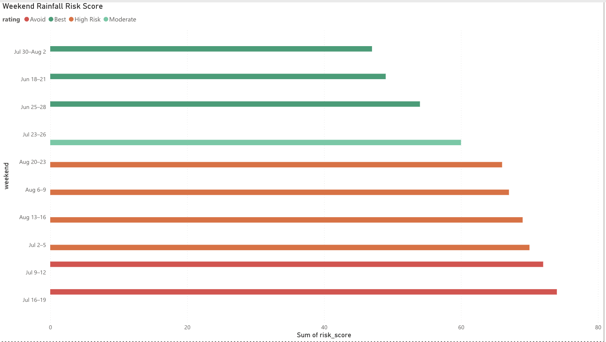
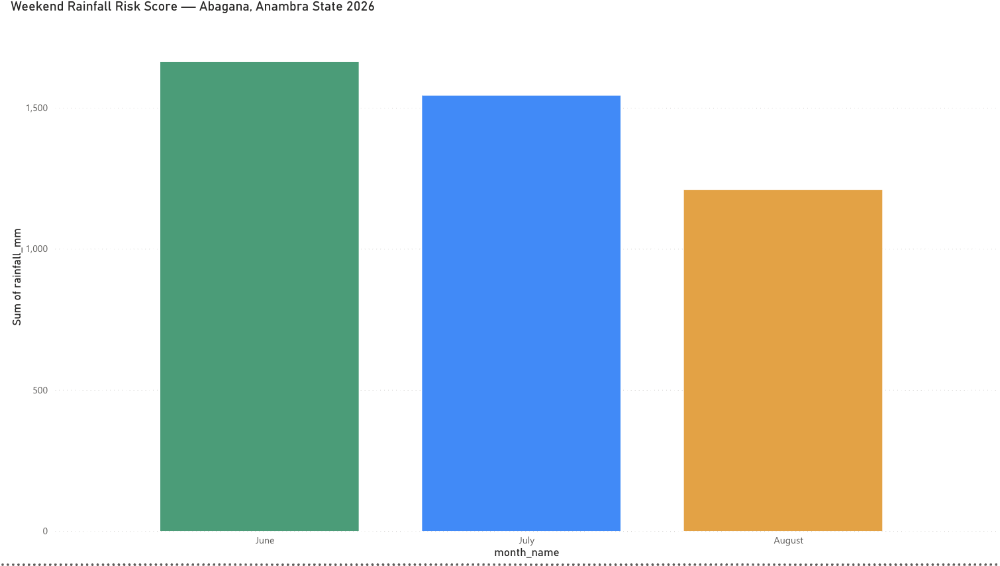
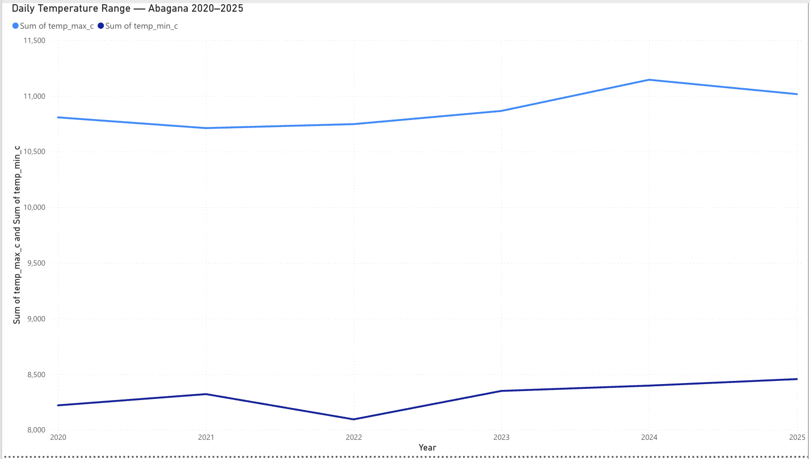
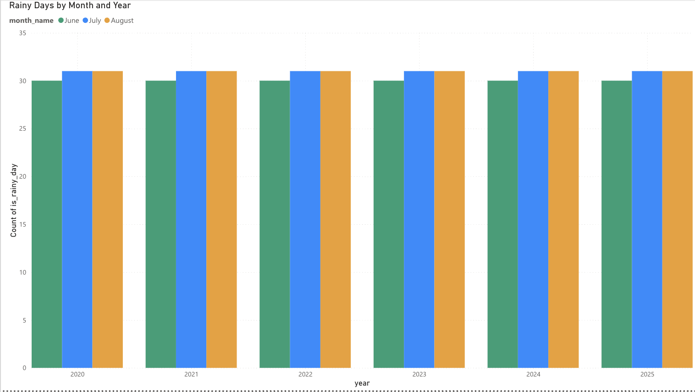
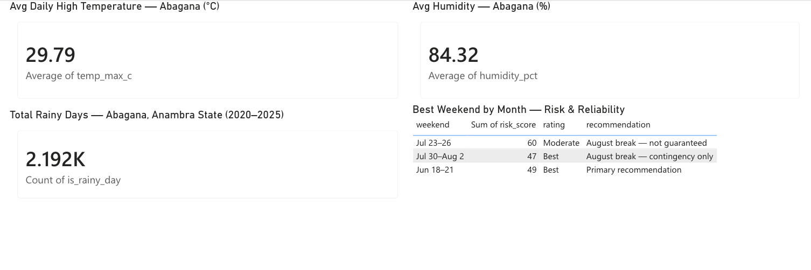

# Nigeria Weather Risk Analysis
### Seasonal Climate Intelligence for Event Planning — Abagana, Anambra State


---

## Overview

This is a personal research project initiated to support the planning of a significant family event — a chief's funeral in Abagana, Anambra State, Nigeria. What began as a practical question about weather became a structured data analysis exercise applying climate science, risk modelling, and data visualisation to a real-world decision.

The project demonstrates the full data analyst workflow: problem framing, data sourcing, cleaning, analysis, visualisation, and communication of findings to a non-technical audience.

> **Core question:** Which Thursday–Sunday weekend between mid-June and end of August 2026 carries the lowest rainfall risk for a three-day outdoor event in Abagana, Anambra State?

---

## Key Finding

**June 18–21, 2026 (Thu–Sun)** is the lowest-risk weekend in the research period.  
**Friday 19 June** carries the highest probability of a dry morning across all weekends studied.

Rain in late June is predominantly convective — short afternoon/evening thunderstorms — making it the most manageable pattern for scheduling outdoor ceremonial events.

---

## Dashboard Preview

### Weekend Rainfall Risk Score


### Monthly Rainfall Profile


### Daily Temperature Range


### Rainy Days by Month and Year


### Key Metric Cards


> Full dashboard PDF: [Nigerian Weather Risk — Abagana 2026](visuals/powerbi/Nigerian%20Weather%20Risk%20-%20Abagana%20Climate%20Prediction%202026.pdf)

---

## Tools & Technologies

| Tool | Purpose |
|------|---------|
| Python (pandas, matplotlib, seaborn) | Data cleaning, analysis, and chart generation |
| Power BI | Interactive dashboard and visualisation |
| Excel | Data preparation and cross-validation |
| Jupyter Notebook (Google Colab) | Documented analysis workflow |
| NASA POWER API | Satellite-derived daily climate data |
| GitHub | Version control and portfolio hosting |

---

## Project Structure

```
nigeria-weather-risk-analysis/
│
├── README.md                               # Project overview (you are here)
├── project_brief.md                        # Full methodology and problem framing
├── requirements.txt                        # Python dependencies
│
├── data/
│   ├── raw/                                # Original downloaded datasets
│   ├── processed/
│   │   ├── abagana_climate_daily_2020_2025.csv    # Full daily climate dataset
│   │   ├── abagana_jja_2020_2025.csv              # June–August subset
│   │   ├── abagana_monthly_summary.csv            # Monthly averages
│   │   ├── weekend_risk_scores.csv                # Weekend risk index
│   │   └── nigeria_weather_risk.xlsx              # Combined Excel for Power BI
│   └── sources.md                          # Data sources and citations
│
├── notebooks/
│   ├── 01_data_collection_cleaning.ipynb   # NASA POWER API + data cleaning
│   └── 02_exploratory_analysis.ipynb       # EDA, charts and risk model
│
├── reports/
│   ├── Abagana_Weather_Report_2026.docx    # Full intelligence report (8 pages)
│   └── Abagana_One_Page_Summary.pdf        # Executive one-page brief
│
├── visuals/
│   └── powerbi/
│       ├── Nigerian Weather Risk - Abagana Climate Prediction 2026.pdf
│       └── screenshots/
│           ├── page1_weekend_risk_score.png
│           ├── page2_monthly_rainfall.png
│           ├── page3_temperature_range.png
│           ├── page4_rainy_days.png
│           └── page5_key_metrics.png
│
└── docs/
    └── methodology.md                      # Detailed methodology notes
```

---

## Data Sources

| Source | Type | Coverage |
|--------|------|----------|
| [NASA POWER API](https://power.larc.nasa.gov/) | Satellite data | Daily climate parameters 2020–2025 |
| [WeatherSpark](https://weatherspark.com/y/52961/Average-Weather-in-Abagana-Nigeria-Year-Round) | Climate averages | 30-year historical averages for Abagana |
| [NiMet Seasonal Climate Predictions](https://nimet.gov.ng/scp) | Official forecast | 2020–2026 annual seasonal predictions |
| [CHIRPS](https://www.chc.ucsb.edu/data/chirps) | Rainfall estimates | High-resolution precipitation data |
| Springer (2010) | Peer-reviewed research | August break — eastern Nigeria |
| World Water Policy (2023) | Peer-reviewed research | Little Dry Season variability |

Full citations: [`data/sources.md`](data/sources.md)

---

## Key Insights

1. **Late June has the most manageable rain pattern** — convective thunderstorms concentrated in the afternoon/evening (4–9pm), leaving mornings clear and predictable.

2. **NASA data reveals a nuance** — June has higher total rainfall than August (1,661mm vs 1,209mm over 2020–2025), but August has fewer rainy days. This means June rain is frequent but short; August rain is less frequent but persistent and all-day. Total rainfall alone is not a reliable risk indicator for event planning.

3. **The August break is unreliable in Anambra** — NiMet consistently rates southeastern Nigeria's Little Dry Season as mild. In 2022 no break occurred at all. Climate research confirms it is weakening in the eastern humid zone due to climate change.

4. **Daily timing matters as much as date selection** — the 6am–1pm window is the safest across all weekends in the period regardless of which date is chosen.

---

## Deliverables

- [x] Full weather intelligence report (Word document, 8 pages)
- [x] One-page executive summary (PDF)
- [x] NASA POWER daily climate dataset (CSV, 2,192 rows)
- [x] Jupyter Notebook — data collection and cleaning
- [x] Jupyter Notebook — exploratory analysis and risk model
- [x] Weekend risk scores dataset (CSV)
- [x] Power BI dashboard (5 pages)
- [x] Dashboard PDF export
- [x] Methodology documentation

---

## How to Run

```bash
# Clone the repository
git clone https://github.com/stanokoye/nigeria-weather-risk-analysis.git
cd nigeria-weather-risk-analysis

# Install dependencies
pip install -r requirements.txt

# Launch the notebook (or open in Google Colab)
jupyter notebook notebooks/01_data_collection_cleaning.ipynb
```

---

## Skills Demonstrated

- Research question framing and scoping
- Multi-source data collection via API (NASA POWER)
- Data cleaning and preparation (Python/pandas)
- Exploratory data analysis
- Risk scoring and ranking methodology
- Data visualisation (matplotlib, Power BI)
- Communication of findings to non-technical stakeholders
- Version control and project documentation (GitHub)

---

## About This Project

This project was driven by a real personal need — supporting the planning of a chief's funeral in Anambra State, Nigeria. It developed into a full data analysis exercise covering the complete analyst workflow from raw API data to an executive-ready intelligence brief.

It is part of my data analytics portfolio demonstrating applied skills across Python, Power BI, and Excel on a real-world problem.

---

## Author

**Stanley Okoye**  
MSc Business Analytics  
Bsc Economics
[LinkedIn](www.linkedin.com/in/stanley-okoye-1a8a9a2a4) · [Portfolio](#)

---

*Data represents seasonal climate averages and probabilistic outlooks only. No long-range forecast can predict exact daily weather. Consult NiMet 7–10 days before any event for precise conditions.*